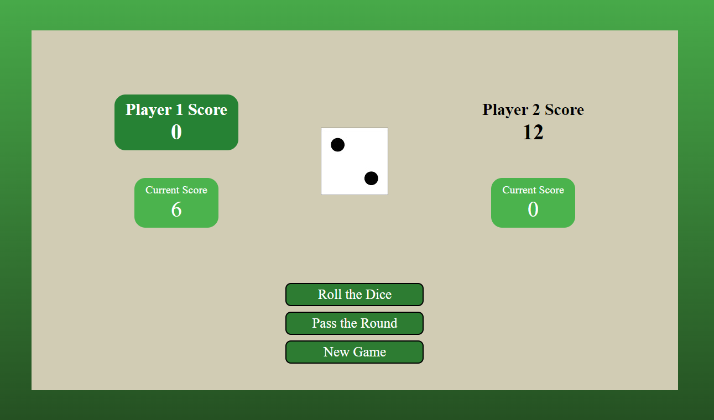

# Dice-Game

Simple browser dice game. 

The goal is to score 30 points by rolling a dice. Whenever player rolls a 1, he loses all his current score and it's next players' turn. If the player wants to keep his points due to the fear of losing them (by rolling a 1), he can willingly pass the round and keep his current score.

